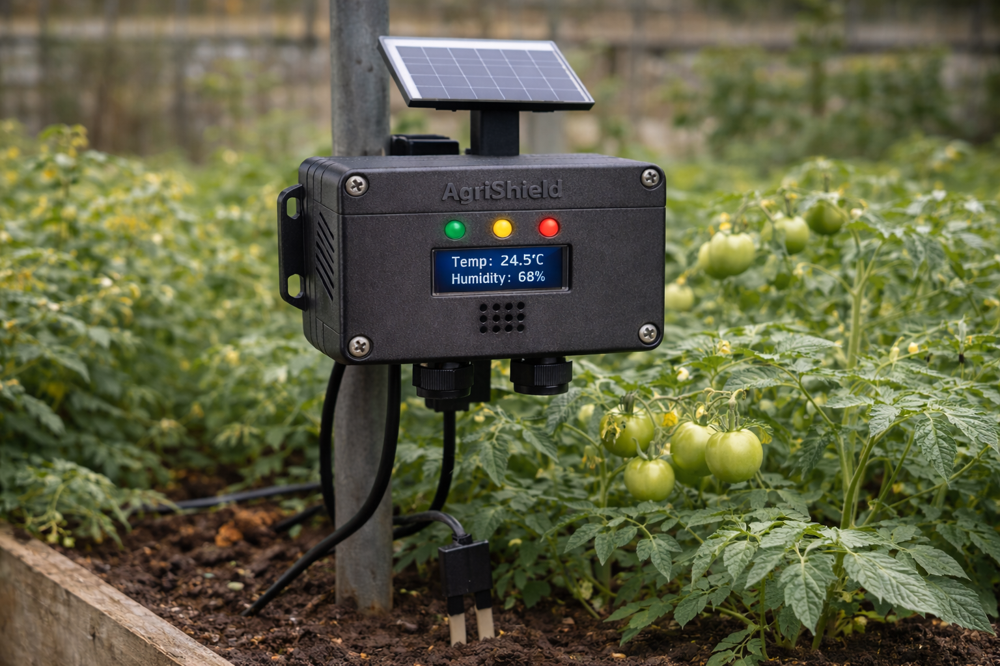

# 🌱 AgriShield

**Protect Today. Harvest Tomorrow.**

AgriShield is an autonomous, solar-powered IoT ecosystem designed to empower farmers with real-time environmental monitoring and early risk detection. Built for rural and low-connectivity environments, it bridges the gap between traditional farming and smart agriculture.



## 🎯 Key Features

- **📶 Local Connectivity**: Operates via a dedicated WiFi Access Point. No internet required.
- **☀️ Energy Autonomy**: Fully solar-powered with intelligent battery management.
- **🚨 Triple-Alert System**: Visual (LED), Audio (Buzzer), and Digital alerts (Mobile App).
- **📦 Multi-Crop Intelligence**: 40+ predefined plantation profiles with calibrated thresholds.
- **📊 Data Integrity**: Local storage (SPIFFS) ensures historical data is always available.
- **📱 Professional API**: OpenAPI 3.0 compliant REST API for mobile app integration.

---

## 📂 Repository Structure

```text
AgriShield/
├── firmware/         # ESP32-C3 Source Code & Build Config
├── docs/             # Technical Reports, API Spec & Project Docs
├── assets/           # Schematics, Flowcharts & Media
└── tools/            # API Test Scripts & Logic Simulations
```

---

## 🛠️ Hardware Stack

- **Microcontroller**: ESP32-C3 (RISC-V)
- **Sensors**: 
  - Dual DHT22 (Air & Soil Environment)
  - DS18B20 (Precision Soil Temperature)
  - Capacitive Soil Moisture Sensor
- **Human Interface**: OLED 128x64 display, Active Buzzer, 3x Status LEDs (R/O/G)
- **Power**: TP4056 Solar Charge Controller + 18650 Li-Ion Battery

---

## 📦 Plant Profiles (API IDs)

The module comes pre-loaded with optimized thresholds for the following categories. Send the corresponding `crop_profile_id` via the `/config` endpoint to auto-configure the module.

| Category | Available IDs |
| :--- | :--- |
| **Vegetables** | `TOMATO_OPEN_FIELD`, `TOMATO_GREENHOUSE`, `PEPPER_OPEN_FIELD`, `PEPPER_GREENHOUSE`, `ONION`, `CABBAGE`, `LETTUCE`, `CARROT`, `POTATO`, `CUCUMBER` |
| **Fruits** | `BANANA`, `MANGO`, `PAPAYA`, `PINEAPPLE`, `CITRUS`, `AVOCADO` |
| **Cereals** | `MAIZE_CORN`, `RICE`, `WHEAT`, `SORGHUM`, `MILLET` |
| **Legumes** | `BEANS`, `PEAS`, `GROUNDNUT_PEANUT`, `SOYBEAN` |
| **Cash Crops** | `COFFEE`, `COCOA`, `TEA`, `COTTON`, `SUGARCANE`, `TOBACCO` |
| **Tubers** | `CASSAVA`, `SWEET_POTATO`, `YAM` |
| **Herbs** | `GINGER`, `GARLIC`, `CHILI_PEPPER` |
| **Special** | `GENERAL_CROP`, `CUSTOM` |

---

## 🚀 Getting Started

### 1. Firmware Installation
Using PlatformIO:
```bash
cd firmware
pio run --target upload
```

### 2. Connect to Module
- **SSID**: `AgriShield-AP`
- **Password**: `agrishield2026`
- **Gateway**: `192.168.4.1`

### 3. Verify System
```bash
python3 tools/test_api.py
```

---

## 📡 API Reference

| Endpoint | Method | Description |
| :--- | :--- | :--- |
| `/status` | `GET` | Get real-time sensor data and alert status |
| `/config` | `POST` | Select crop profile or set manual thresholds |
| `/data/log` | `GET` | Download historical sensor data (JSON) |
| `/health` | `GET` | System uptime and firmware version |

---

## 🏗️ System Architecture

Refer to [docs/Architecture_Report.pdf](docs/Architecture_Report.pdf) for the full scientific breakdown of the risk assessment algorithms used in AgriShield.

---

## 📄 License

This project is licensed under the MIT License - see the [LICENSE](LICENSE) file for details.

---

**Developed with ❤️ for Farmers Everywhere.**
